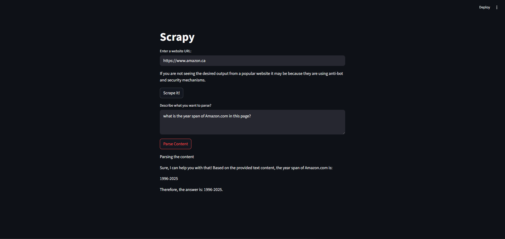
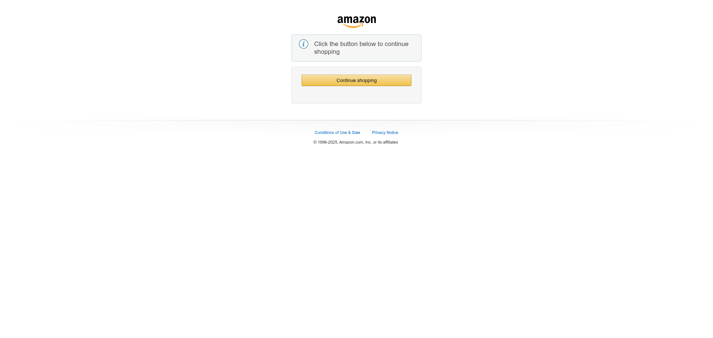

# Scrapy 🕷️

**A Web Scraper Retrieval-Augmented Generation (RAG) System**  
Built using **Selenium**, **Streamlit**, and **Bright Data Web Scraping API**

P.S. If you are not seeing the desired output from a popular website it may be because they are using anti-bot and security mechanisms.

---

## 📌 Overview

**Scrapy** is a modular web scraping application that integrates **RAG (Retrieval-Augmented Generation)** capabilities to extract and process structured data from web pages. This system can be used to:
- Extract dynamic content from websites
- Interface with users via a **Streamlit** web UI
- Leverage **Bright Data’s** scraping infrastructure for enhanced reliability
- Run analysis or pass scraped data into LLM pipelines

---

## ⚙️ Tech Stack

- **Python**
- **Selenium** – For headless browser automation and dynamic content rendering
- **Streamlit** – For the interactive web UI
- **Bright Data Web Scraping API** – For robust scraping of websites with anti-bot measures
- **LangChain / RAG Architecture (optional)** – For integrating with LLMs

---

## 🖼️ Screenshots

### 🔧 Streamlit Interface

### 🌐 Website Scraped Example

---

## Features
- Dynamic scraping with Selenium
- Bright Data API Integration for bypassing complex anti-bot challenges
- Clean, interactive interface with Streamlit
- Modular structure for plugging in RAG pipelines or further NLP processing

## Potential Use Cases
- Market competitor analysis
- E-commerce pricing tracker
- Feed generator for LLMs
